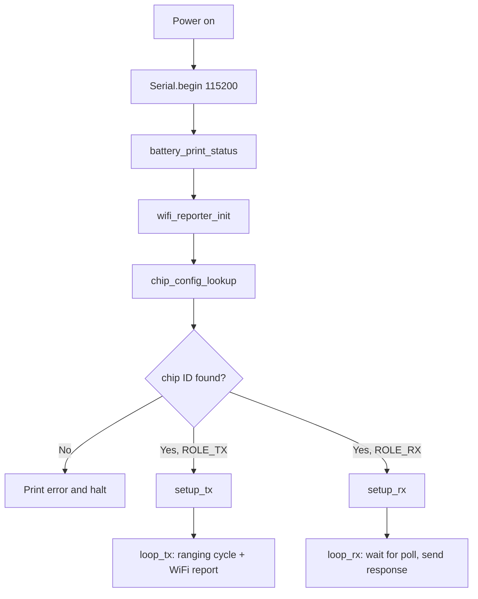

# ESP32 + DW3000 UWB Single-Sided Two-Way Ranging

A PlatformIO / Arduino-framework project for the ESP32 that implements **Single-Sided Two-Way Ranging (SS-TWR)** using the Qorvo DW3000 UWB radio. One device acts as a **TX initiator (tag)** and up to three devices act as **RX responders (anchors)**. The same firmware binary is flashed to every board — the role is selected automatically at boot based on the ESP32's 48-bit eFuse MAC address (chip ID). After each ranging cycle the tag reports distances and battery voltage to a REST server over WiFi.

---

## Table of Contents

1. [Project Structure](#1-project-structure)
2. [Hardware](#2-hardware)
   - [Pin Assignments](#pin-assignments)
   - [Battery Circuit](#battery-circuit)
3. [DW3000 Radio Configuration](#3-dw3000-radio-configuration)
4. [Dependencies](#4-dependencies)
5. [Configuration Before Flashing](#5-configuration-before-flashing)
   - [Register Chip IDs](#51-register-chip-ids-in-srcchip_configcpp)
   - [Set WiFi Credentials and Server Endpoint](#52-set-wifi-credentials-and-server-endpoint-in-srcwifi_reporterh)
6. [How It Works](#6-how-it-works)
   - [Boot Sequence](#boot-sequence)
   - [Ranging Flow (SS-TWR)](#ranging-flow-ss-twr)
   - [WiFi Reporting](#wifi-reporting)
7. [HTTP POST Payload](#7-http-post-payload)
8. [Build and Flash](#8-build-and-flash)
9. [Serial Output Examples](#9-serial-output-examples)
10. [Notes and Caveats](#10-notes-and-caveats)

---

## 1. Project Structure

```
.
├── platformio.ini          # PlatformIO build configuration
├── lib/
│   └── Dw3000/             # Local DW3000 driver library
└── src/
    ├── main.cpp            # Entry point: role resolution, init, dispatch
    ├── chip_config.h/.cpp  # Chip-ID-to-role mapping table
    ├── common.h/.cpp       # Shared DW3000 config, SPI pins, frame constants
    ├── tx.h/.cpp           # TX (initiator/tag) logic
    ├── rx.h/.cpp           # RX (responder/anchor) logic
    ├── battery.h/.cpp      # Battery voltage measurement via ADC
    └── wifi_reporter.h/.cpp# WiFi connection and HTTP POST reporting
```

| File | Purpose |
|---|---|
| [`src/main.cpp`](src/main.cpp) | Reads chip ID, resolves role, initialises WiFi and battery monitoring, dispatches to TX or RX `setup()`/`loop()` |
| [`src/chip_config.h`](src/chip_config.h) / [`src/chip_config.cpp`](src/chip_config.cpp) | Maps 48-bit chip IDs to roles (`ROLE_TX` / `ROLE_RX`) and device numbers. **Edit `chip_table[]` to register your boards.** |
| [`src/common.h`](src/common.h) / [`src/common.cpp`](src/common.cpp) | Shared DW3000 `dwt_config_t`, SPI pin definitions, frame index constants, antenna delay values |
| [`src/tx.h`](src/tx.h) / [`src/tx.cpp`](src/tx.cpp) | Initiator logic: polls each anchor in turn, computes TOF distance with clock-offset correction, triggers WiFi report |
| [`src/rx.h`](src/rx.h) / [`src/rx.cpp`](src/rx.cpp) | Responder logic: waits for a Poll frame addressed to this anchor, records timestamps, sends Response |
| [`src/battery.h`](src/battery.h) / [`src/battery.cpp`](src/battery.cpp) | Reads battery voltage via GPIO 34 ADC (8-sample average, ×2 divider correction) |
| [`src/wifi_reporter.h`](src/wifi_reporter.h) / [`src/wifi_reporter.cpp`](src/wifi_reporter.cpp) | Connects to WiFi (station mode), HTTP POSTs JSON status after each ranging cycle |

---

## 2. Hardware

### Pin Assignments

| ESP32 GPIO | Signal | Direction | Notes |
|---|---|---|---|
| 5 | SPI CS (DW3000) | Output | Chip select, active-low |
| 4 | IRQ (DW3000) | Input | Configured as `INPUT`; currently **polled**, not interrupt-driven |
| -1 | RST (DW3000) | — | Not connected; soft reset used (`PIN_RST = -1`) |
| 23 | SPI MOSI | Output | VSPI default |
| 19 | SPI MISO | Input | VSPI default |
| 18 | SPI SCK | Output | VSPI default |
| 34 | Battery ADC | Input | Input-only pin; 2 × 1 MΩ voltage divider from 3.7 V LiPo |

> **Tip:** SPI pins 18/19/23 are the ESP32 VSPI defaults. The build flag `-D USE_HSPI` is set in [`platformio.ini`](platformio.ini) — verify that [`lib/Dw3000/src/dw3000_port.cpp`](lib/Dw3000/src/dw3000_port.cpp) honours this flag for your board variant.

### Battery Circuit

```
3.7 V LiPo (+)
      │
    1 MΩ
      │
      ├──── GPIO 34 (ADC input)
      │
    1 MΩ
      │
     GND
```

- Voltage divider ratio = **0.5** → ADC reads half the battery voltage.
- [`battery_read_voltage()`](src/battery.cpp:4) averages 8 ADC samples, scales to 3.3 V reference, then multiplies by 2.
- Thresholds defined in [`src/battery.h`](src/battery.h):

| State | Condition |
|---|---|
| `[OK]` | ≥ 3.5 V |
| `[LOW]` | < 3.5 V |
| `[CRITICAL]` | < 3.3 V |

Battery status is printed once at boot and then every **30 seconds** during normal operation.

---

## 3. DW3000 Radio Configuration

Defined in [`src/common.cpp`](src/common.cpp:9):

| Parameter | Value | Meaning |
|---|---|---|
| Channel | 5 | UWB channel 5 (~6.5 GHz centre) |
| Preamble length | `DWT_PLEN_128` | 128 symbols (TX) |
| PAC size | `DWT_PAC8` | 8-symbol acquisition chunk (RX) |
| TX/RX preamble code | 9 | |
| SFD type | 1 | Non-standard 8-symbol SFD |
| Data rate | `DWT_BR_6M8` | 6.8 Mbps |
| PHY header mode | `DWT_PHRMODE_STD` | Standard |
| STS | `DWT_STS_MODE_OFF` | Disabled (non-STS mode) |
| PDoA | `DWT_PDOA_M0` | Disabled |
| TX antenna delay | `16385` (DW time units) | Hard-coded; calibrate per device for best accuracy |
| RX antenna delay | `16385` (DW time units) | Hard-coded; calibrate per device for best accuracy |

---

## 4. Dependencies

Declared in [`platformio.ini`](platformio.ini):

| Library | Source | Version |
|---|---|---|
| `Dw3000` | Local — `lib/Dw3000/` | bundled |
| `SparkFun BNO08x Cortex Based IMU` | `sparkfun/SparkFun BNO08x Cortex Based IMU` | `^1.0.5` |
| `ArduinoJson` | `bblanchon/ArduinoJson` | `^7.0.0` |

Platform / board:

```ini
platform  = espressif32
board     = esp32dev
framework = arduino
```

Build flags: `-D USE_HSPI -D MAIN_U1`

---

## 5. Configuration Before Flashing

Two files must be edited before the firmware is ready to use.

### 5.1 Register Chip IDs in [`src/chip_config.cpp`](src/chip_config.cpp)

Edit the [`chip_table[]`](src/chip_config.cpp:18) array to map each physical board to its role and number:

```cpp
static const chip_config_entry_t chip_table[] = {
    // chip_id              role      number
    { 0xA1B2C3D4E5F6, ROLE_TX, 1 },  // tag
    { 0x112233445566, ROLE_RX, 1 },  // anchor 1
    { 0x778899AABBCC, ROLE_RX, 2 },  // anchor 2
    { 0xDDEEFF001122, ROLE_RX, 3 },  // anchor 3
};
```

**How to find a chip's ID:**

1. Flash any firmware to the board (the current firmware works fine).
2. Open a serial monitor at **115200 baud**.
3. Read the `Chip ID :` line printed at boot, e.g.:

   ```
   Chip ID : F8B3B74973D4
   ```

4. Paste the 12-digit hex value as `0x<value>` into `chip_table[]`.

> If a board's chip ID is not found in the table, the firmware prints an error and **halts** — it will not proceed to ranging. This is intentional to prevent silent misconfiguration.

### 5.2 Set WiFi Credentials and Server Endpoint in [`src/wifi_reporter.h`](src/wifi_reporter.h)

```cpp
#define WIFI_SSID     "your_ssid"
#define WIFI_PASSWORD "your_password"
#define SERVER_HOST   "192.168.1.197"   // IP or hostname of your REST server
#define SERVER_PORT   8080              // TCP port
#define SERVER_PATH   "/api/status"     // URL path for the POST endpoint
```

The tag will POST to `http://<SERVER_HOST>:<SERVER_PORT><SERVER_PATH>` after every complete ranging cycle.

> WiFi failure at boot is **non-fatal**. If the connection times out (default: 10 000 ms), ranging continues offline and each cycle prints `[WiFi] Not connected — skipping report.`

---

## 6. How It Works

### Boot Sequence



### Ranging Flow (SS-TWR)

The SS-TWR exchange between the tag and one anchor:

```
Tag (TX/initiator)                    Anchor (RX/responder)
        |                                      |
        |--- Poll frame (anchor index N) ----->|  T_poll_tx / T_poll_rx
        |                                      |  (records T_poll_rx)
        |                                      |  waits POLL_RX_TO_RESP_TX_DLY_UUS (550 µs)
        |<-- Response frame (T_poll_rx,        |  T_resp_tx
        |                    T_resp_tx) --------|
        |                                      |
   T_resp_rx                                   |
        |                                      |
   Compute TOF:
     round_trip = T_resp_rx - T_poll_tx
     reply_time = T_resp_tx - T_poll_rx
     tof        = (round_trip - reply_time) / 2
     distance   = tof × speed_of_light
```

1. The tag sends a **Poll** frame with byte 8 set to the target anchor index (1–3).
2. The anchor receives the Poll, records `T_poll_rx`, waits 550 UWB-µs, then transmits a **Response** frame embedding both `T_poll_rx` and `T_resp_tx`.
3. The tag receives the Response, reads the embedded timestamps, and computes the time-of-flight using the SS-TWR clock-offset correction formula.
4. After ranging all three anchors, the tag prints the distances and sends an HTTP POST report.

Key timing constants:

| Constant | Value | Location |
|---|---|---|
| `POLL_TX_TO_RESP_RX_DLY_UUS` | 200 UWB-µs | [`src/tx.h`](src/tx.h:16) |
| `RESP_RX_TIMEOUT_UUS` | 360 UWB-µs | [`src/tx.h`](src/tx.h:19) |
| `POLL_RX_TO_RESP_TX_DLY_UUS` | 550 UWB-µs | [`src/rx.h`](src/rx.h:10) |
| `RNG_DELAY_MS` | 1000 ms | [`src/tx.h`](src/tx.h:6) — inter-cycle pause |
| `NUM_ANCHORS` | 3 | [`src/tx.h`](src/tx.h:9) |

### WiFi Reporting

After a complete ranging cycle [`loop_tx()`](src/tx.cpp) calls [`wifi_report()`](src/wifi_reporter.cpp:37), which:

1. Checks `WiFi.status()` — skips silently if not connected.
2. Builds a JSON document using ArduinoJson.
3. HTTP POSTs the JSON body to the configured endpoint.
4. Prints the HTTP response code (or transport error) to Serial.

---

## 7. HTTP POST Payload

`Content-Type: application/json`

```json
{
  "chip_id": "F8B3B74973D4",
  "anchor_distances": ["1.23", "2.45", "3.67"],
  "battery_v": "3.82"
}
```

| Field | Type | Description |
|---|---|---|
| `chip_id` | string | 12-digit hex representation of the tag's 48-bit MAC |
| `anchor_distances` | array of strings | Distance to each anchor in metres, 2 decimal places; index matches anchor number (1-based) |
| `battery_v` | string | Battery voltage in volts, 2 decimal places |

---

## 8. Build and Flash

**Prerequisites:** [PlatformIO Core](https://docs.platformio.org/en/latest/core/installation/index.html) (CLI or VS Code extension).

```bash
# Build and upload to the connected ESP32
pio run -e uwb -t upload

# Open serial monitor at 115200 baud
pio device monitor -b 115200
```

To build without uploading:

```bash
pio run -e uwb
```

The compiled binary is written to `.pio/build/uwb/firmware.bin`. Flash the **same binary** to every board — role selection is fully automatic.

---

## 9. Serial Output Examples

### Tag (TX) at boot and first ranging cycle

```
Battery: 3.82 V [OK]
[WiFi] Connecting to "my_network" ...
[WiFi] Connected. IP: 192.168.1.55
Chip ID : F8B3B74973D4
Role    : TX (initiator/tag)
Number  : 1
Starting as TX (tag #1)
A1 DIST: 1.23 m
A2 DIST: 2.45 m
A3 DIST: 3.67 m
1.23 m  2.45 m  3.67 m
[WiFi] POST http://192.168.1.197:8080/api/status  body: {"chip_id":"F8B3B74973D4","anchor_distances":["1.23","2.45","3.67"],"battery_v":"3.82"}
[WiFi] Response: 200
```

### Anchor (RX) at boot

```
Battery: 3.79 V [OK]
[WiFi] Connecting to "my_network" ...
[WiFi] Connected. IP: 192.168.1.56
Chip ID : F8B3B7495D18
Role    : RX (responder/anchor)
Number  : 1
Starting as RX (anchor #1)
```

### Unknown chip ID (halts)

```
Battery: 3.81 V [OK]
[WiFi] Connecting to "my_network" ...
[WiFi] Connected. IP: 192.168.1.57
Chip ID : AABBCCDDEEFF
Config  : NOT FOUND in chip table — halting.
ERROR: chip ID not in table. Add it to src/chip_config.cpp and reflash.
```

### WiFi offline

```
[WiFi] Connecting to "my_network" ...
[WiFi] Connection timed out. Continuing without WiFi.
...
[WiFi] Not connected — skipping report.
```

---

## 10. Notes and Caveats

- **IRQ pin discrepancy:** [`PIN_IRQ`](src/common.cpp:5) is defined as GPIO **4** in [`src/common.cpp`](src/common.cpp). If your schematic wires the DW3000 IRQ line to a different GPIO, update `PIN_IRQ` in that file. The pin is configured as `INPUT` but is **never used as a hardware interrupt** — the firmware uses polled mode throughout.

- **Antenna delay calibration:** Both TX and RX antenna delays are hard-coded to `16385` DW time units ([`TX_ANT_DLY`](src/common.h:17) / [`RX_ANT_DLY`](src/common.h:18)). For production-grade accuracy each device should be individually calibrated. Refer to the Qorvo DW3000 User Manual for the calibration procedure.

- **Single binary for all roles:** The same `.bin` is flashed to every board. Role selection happens entirely at runtime via [`chip_config_lookup()`](src/chip_config.cpp:48). There is no need to maintain separate firmware builds per role.

- **Multi-tag support:** The `number` field for `ROLE_TX` entries is reserved for future multi-tag setups. Currently only one tag is expected to be active at a time; simultaneous tags will collide on the UWB channel.

- **BNO08x IMU dependency:** The `SparkFun BNO08x` library is listed as a dependency in [`platformio.ini`](platformio.ini) but is not used in the current source. It is included for future orientation/heading integration.

- **WiFi timeout:** The default connection timeout is **10 000 ms** ([`WIFI_CONNECT_TIMEOUT_MS`](src/wifi_reporter.h:24)). Adjust this value if your access point takes longer to associate.

- **Battery ADC accuracy:** The ESP32 ADC is non-linear. For higher accuracy consider applying the ESP-IDF ADC calibration API or an external ADC. The current implementation uses a simple linear scaling against the 3.3 V reference.
